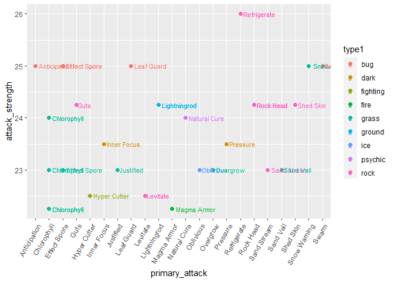

```r
library(tidyverse)
```

```
## ── Attaching packages ─────────────────────────────────────── tidyverse 1.3.2 ──
## ✔ ggplot2 3.4.0      ✔ purrr   1.0.0 
## ✔ tibble  3.1.8      ✔ dplyr   1.0.10
## ✔ tidyr   1.2.1      ✔ stringr 1.5.0 
## ✔ readr   2.1.3      ✔ forcats 0.5.2 
## ── Conflicts ────────────────────────────────────────── tidyverse_conflicts() ──
## ✖ dplyr::filter() masks stats::filter()
## ✖ dplyr::lag()    masks stats::lag()
```

```r
library(janitor)
```

```
## 
## Attaching package: 'janitor'
## 
## The following objects are masked from 'package:stats':
## 
##     chisq.test, fisher.test
```

```r
library(dplyr)
library(shiny)
```


```r
pokemon <- readr::read_csv("pokemon.csv")
```

```
## Rows: 801 Columns: 41
## ── Column specification ────────────────────────────────────────────────────────
## Delimiter: ","
## chr  (7): abilities, capture_rate, classfication, japanese_name, name, type1...
## dbl (34): against_bug, against_dark, against_dragon, against_electric, again...
## 
## ℹ Use `spec()` to retrieve the full column specification for this data.
## ℹ Specify the column types or set `show_col_types = FALSE` to quiet this message.
```

1. Separating attack set into primary secondary and tertiary and reading it


```r
pokemon_tidy <- pokemon %>% 
  mutate(abilities = gsub("\\[|\\]|'", "", abilities)) %>% 
  # gsub replaces all these mentioned characters with a blank (nothing)
  
  separate(abilities, c("primary_attack", "secondary_attack", "tertiary_attack"), sep = ",", fill = "right")
```

```
## Warning: Expected 3 pieces. Additional pieces discarded in 20 rows [19, 20, 27,
## 28, 37, 38, 50, 51, 52, 53, 74, 75, 76, 88, 89, 103, 105, 550, 678, 745].
```

```r
write.csv(pokemon_tidy, "pokemon_tidy.csv")
```

2. App comparing stats by type


```r
pokemon_tidy %>% 
  group_by(type1) %>% 
  summarize(mean_attack = mean(attack)) %>% 
  ggplot(aes(x = type1, y = mean_attack, fill = type1))+
  geom_col()
```

<!-- -->


```r
pokemon_stats <- pokemon_tidy %>% 
  group_by(type1) %>% 
  summarize(mean_attack = mean(attack), mean_defense = mean(defense), mean_hp = mean(hp), mean_spattack = mean(sp_attack), mean_spdefense = mean(sp_defense), mean_speed = mean(speed), mean_basetotal = mean(base_total))
```


```r
ui <- fluidPage(
    selectInput("y", "Select Stat to Compare", choices = c("mean_attack", "mean_defense", "mean_hp", "mean_spattack", "mean_spdefense", "mean_speed", "mean_basetotal"), 
              selected = "mean_attack"),
    plotOutput("plot", width = "500px", height = "400px")
)

server <- function(input, output) {
  output$plot <- renderPlot({
    ggplot(data = pokemon_stats, aes_string(x = "type1", y = input$y, fill = "type1"))+
      geom_col()
  })   
}

shinyApp(ui, server)
```

```{=html}
<div style="width: 100% ; height: 400px ; text-align: center; box-sizing: border-box; -moz-box-sizing: border-box; -webkit-box-sizing: border-box;" class="muted well">Shiny applications not supported in static R Markdown documents</div>
```

3. Finding the current best and worst pokemon

```r
pokemon_tidy %>% 
  select(name, base_total) %>% 
  arrange(desc(base_total)) %>% 
  slice_head(n = 5)
```

```
## # A tibble: 5 × 2
##   name     base_total
##   <chr>         <dbl>
## 1 Mewtwo          780
## 2 Rayquaza        780
## 3 Kyogre          770
## 4 Groudon         770
## 5 Arceus          720
```


```r
pokemon_tidy %>% 
  select(name, base_total) %>% 
  arrange(base_total) %>% 
  slice_head(n = 5)
```

```
## # A tibble: 5 × 2
##   name      base_total
##   <chr>          <dbl>
## 1 Sunkern          180
## 2 Azurill          190
## 3 Kricketot        194
## 4 Caterpie         195
## 5 Weedle           195
```

4. Strongest attacks

```r
pokemon_tidy <- pokemon_tidy %>% 
  mutate(attack_strength = rowSums(select(., starts_with("against"))))
```


```r
pokemon_tidy %>% 
  select(primary_attack, attack_strength, type1) %>%
  arrange(desc(attack_strength)) %>% 
  slice_head(n = 40) %>% 
  ggplot(aes(x = primary_attack, y = attack_strength, color = type1)) +
  geom_point(size = 2)+
  geom_text(aes(label = primary_attack), hjust = -0.1, size = 3)+
  theme(axis.text.x = element_text(angle = 60, hjust = 1))
```

<!-- -->

```r
#Strongest attack is refrigate (becomes our primary attack)
```

```r
pokemon_tidy %>% 
  select(primary_attack, attack_strength, type1) %>% 
  filter(type1 == "dragon") %>% 
  arrange(desc(attack_strength)) %>% 
  slice_head(n = 10) %>% 
  ggplot(aes(x = primary_attack, y = attack_strength))+
  geom_point(size = 3)+
  geom_text(aes(label = primary_attack), hjust = -0.1, size = 3)+
  theme(axis.text.x = element_text(angle = 60, hjust = 1))
```

<!-- -->

```r
#Since we are building a dragon type, we need a secondary attack of a dragon type, so here are the strongest ones. (Pressure or Bulletproof)
```

